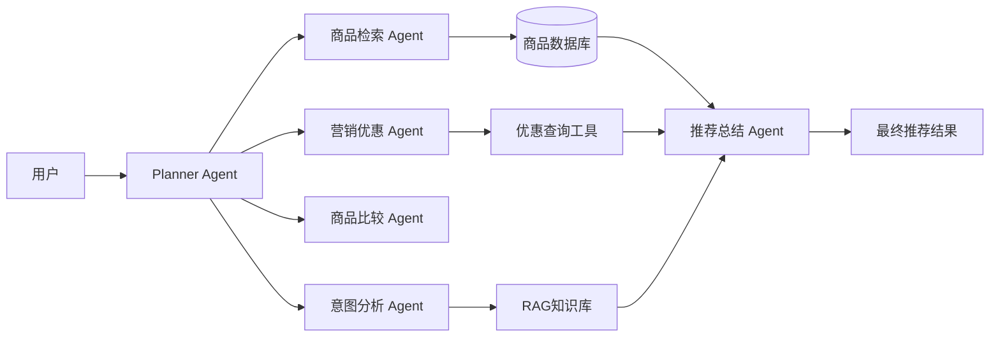
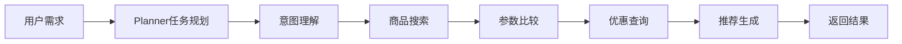
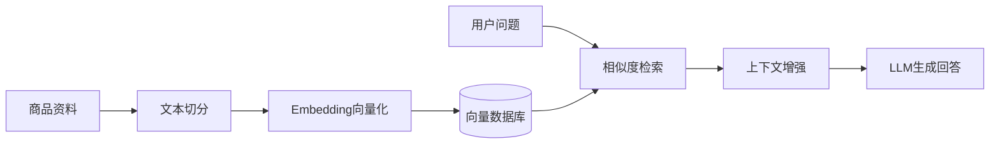

# Multi-Agent 智能导购系统

## 项目背景

随着 3C 数码产品线上消费规模不断扩大，用户在购买手机、电脑等产品时，需要综合考虑价格、性能、拍摄能力、使用场景以及优惠活动等多维因素。

传统电商搜索主要依赖关键词匹配，用户仍需要主动浏览大量商品参数，难以快速获得符合个人需求的购买建议。

本项目面向 3C 电商智能导购场景，基于大语言模型（LLM）、Multi-Agent 协同架构以及 RAG 检索增强技术，实现从用户需求理解、商品检索、参数分析、优惠查询到个性化推荐的智能购物辅助流程。

---

# 项目介绍

系统通过多个专业 Agent 协同完成复杂购物任务：

- 用户需求分析
- 商品检索
- 商品参数比较
- 优惠活动查询
- 推荐结果生成

相比传统单 Agent 问答方式，本项目通过任务拆分和工具调用，使大模型能够结合业务数据完成更加准确的商品推荐。


# 系统架构



---

# Agent执行流程



---

# RAG流程



---

# 核心功能展示

## 用户需求

示例：

> 推荐一款5000元以内，适合拍照的手机


## Agent处理过程

```
用户需求

↓

Planner Agent分析

预算：5000以内
需求：拍照

↓

Product Agent查询商品

↓

Compare Agent分析参数

↓

Coupon Agent查询优惠

↓

Recommendation Agent生成建议
```


# 项目亮点

## 1. Multi-Agent任务拆分

通过多个专业 Agent 分担不同任务：

| Agent | 职责 |
| --- | --- |
| Planner Agent | 分析任务并规划执行流程 |
| Product Agent | 商品检索 |
| Compare Agent | 参数对比 |
| Coupon Agent | 优惠查询 |
| Recommendation Agent | 生成最终推荐 |


## 2. RAG知识增强

解决大模型无法实时获取商品信息的问题。

流程：

```
商品数据

↓

文本切分

↓

Embedding

↓

向量检索

↓

上下文增强

↓

LLM回答
```


## 3. Tool Calling业务能力扩展

Agent通过工具获取结构化业务数据：

- 商品查询
- 价格查询
- 库存查询
- 优惠查询


# 项目结构

```
multi-agent-shopping-assistant

├── backend
│   └── main.py

├── workflow
│   └── graph.py

├── agents
│   ├── planner_agent.py
│   ├── product_agent.py
│   ├── compare_agent.py
│   ├── coupon_agent.py
│   └── recommendation_agent.py

├── tools
│   ├── product_search.py
│   ├── price_query.py
│   └── coupon_query.py

├── rag
│   ├── loader.py
│   ├── embedding.py
│   └── retriever.py

├── data
│   └── products.json

└── requirements.txt
```


# 技术栈

| 技术 | 应用 |
| --- | --- |
| Python | 后端开发 |
| FastAPI | 服务接口 |
| LangChain | LLM应用开发 |
| LangGraph | Agent流程编排 |
| RAG | 知识增强 |
| FAISS/Milvus | 向量检索 |
| MySQL | 业务数据 |
| Redis | 缓存 |


# 面试重点

## 为什么采用 Multi-Agent？

复杂任务由多个 Agent 分工完成，相比单 Agent 更容易进行任务拆分、流程控制和能力扩展。


## 为什么使用 RAG？

商品信息属于业务数据，模型本身无法实时获取。

通过 RAG 将业务知识检索后加入上下文，提高回答准确性并降低幻觉。


## Agent如何访问业务数据？

通过 Tool Calling 调用业务工具，例如：

- 查询商品
- 查询价格
- 查询库存

获取结构化结果后再由模型总结。


# 项目总结

本项目围绕 3C 电商智能导购场景，实践了大语言模型在业务系统中的应用。

重点实现：

- Multi-Agent架构设计
- Agent任务编排
- RAG知识增强
- Tool Calling业务接入
- AI应用工程化设计
